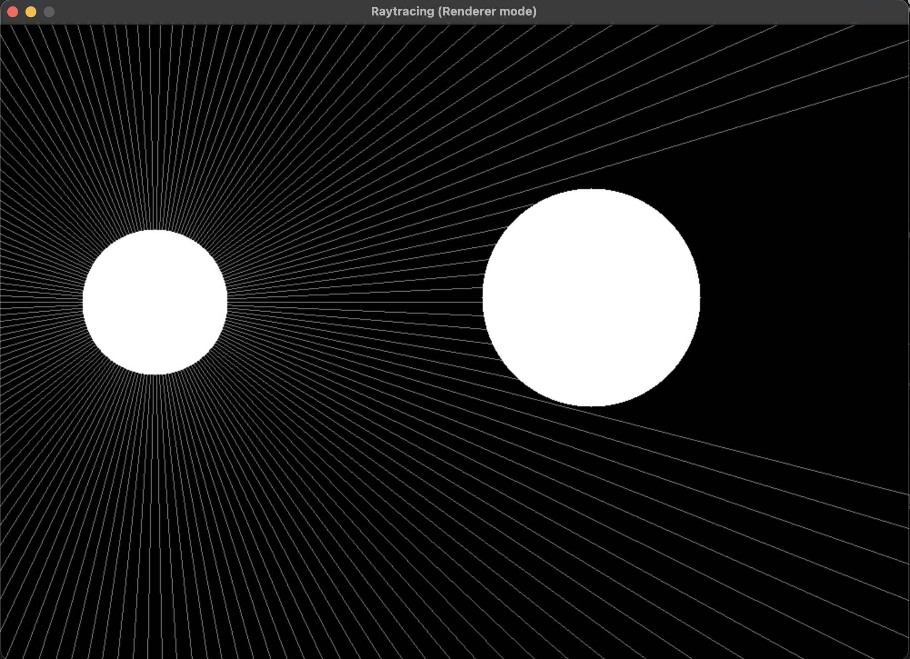

# 2D Raytracer with SDL2

A simple **real-time 2D raytracer prototype** built in **C with SDL2**.  
Rays are emitted from a light source and stopped when they hit objects (circles).  
This creates a **hard-shadow casting effect** that can be moved interactively with the mouse.

---

## 📸 Demo


---

## ⚡ Features

- C + SDL2 hardware-accelerated rendering (`SDL_Renderer`).
- Light source follows your mouse.
- Rays emitted in all directions (150 configurable).
- Circle obstacle blocks rays → real-time shadow casting.
- Basic ray–circle intersection math.

---

## 📐 Math Behind the Raytracer

### Ray equation

A ray is defined by:

$$
P(t) = O + t \cdot d, \quad t \geq 0
$$

- \( O = (x_0, y_0) \) = ray origin (light source).
- \( d = (\cos\theta, \sin\theta) \) = direction vector (unit length).
- \( t \) = distance along the ray.

---

### Circle equation

A circle with center \( C = (c_x, c_y) \) and radius \( r \):

$$
(x - c_x)^2 + (y - c_y)^2 = r^2
$$

---

### Ray–circle intersection

Plugging the ray into the circle equation:

$$
(O + t d - C) \cdot (O + t d - C) = r^2
$$

Expands to a quadratic in \(t\):

$$
a t^2 + b t + c = 0
$$

where:

$$
a = d \cdot d, \quad b = 2 d \cdot (O - C), \quad c = (O - C)\cdot(O - C) - r^2
$$

Discriminant:

$$
\Delta = b^2 - 4ac
$$

- If \( \Delta < 0 \): no intersection.
- If \( \Delta \ge 0 \):

$$
t = \frac{-b \pm \sqrt{\Delta}}{2a}
$$

Choose the **smallest positive \( t \)** to find the first hit.

---

### Hit point

The ray endpoint at intersection is:

$$
P(t_{\text{hit}}) = O + t_{\text{hit}} \cdot d
$$

---

### Shadow casting

- Emit evenly spaced rays in a circle:

$$
\Delta \theta = \frac{2 \pi}{N}
$$

- Each ray endpoint =
    - Screen edge if no hit.
    - Circle boundary if hit.

Thus obstacles block rays and create real-time shadows.

## 🏗️ How it Works Step by Step

1. **Generate rays** around full \(360^\circ\).
   ```c
   angle = i * (2 * M_PI / RAYS_NUMBER);
   dx = cos(angle);
   dy = sin(angle);
   ```

2. **Test each ray** against all circles in the scene (blockers).
    - Use quadratic intersection.
    - If hit → shorten to \(t_{\text{hit}}\).
    - Else → keep screen border endpoint.

3. **Render**:
    - For each ray, draw a line from \((x_0,y_0)\) → endpoint.
    - Draw obstacles and light.

4. Done → interactive raytracing demo.

---

## 🎮 Controls

- **Mouse drag** → moves the light source around the window.
- Rays and shadows update in real time.